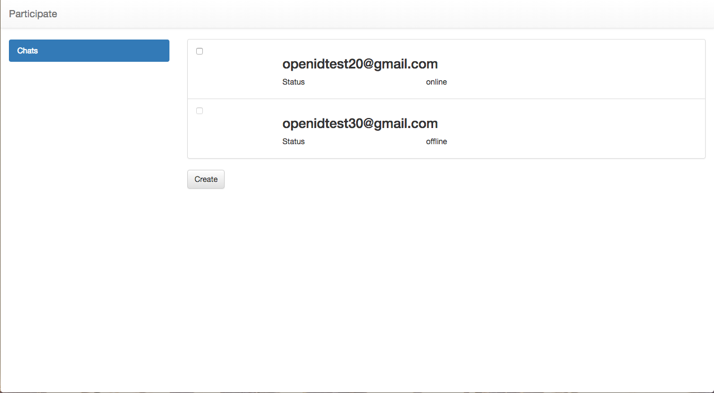

# Application development proposal

##Overview

The aim of this document is being a proposal a set of technologies and the way to handle them in order to develop applications using rethink API.

##Participate

### My City

Under Participate as an umbrella scenario, the users of My City will be able to interact with the managers of the local government and other users.
The user application supports these features:

* Participate in chat conversations
* Create group chats based on proximity

### User Journey

1. User authentication. If the user is not logged in, authentication is required.

2. A chat list and a button to create a new one is provided to the user.

3. User clicks on new button and the system asks the chat name.

4. A list of participants is showed and the user selects one or more to start a new group chat. Actually this list is hard coded on the application. However participant status is getting making a query to Hyperty Discovery Service.

5. The chat is created.

6. Participants can send messages to the group or limit these based on proximity.

7. Chats shows number of participants, date, chat name and last message sended.

##Technologies involve

* [React](http://facebook.github.io/react/index.html)
* [react-router](https://github.com/reactjs/react-router)
* [redux](http://redux.js.org/index.html)
* [Bootstrap](http://getbootstrap.com/)

##Architecture

####Static View

**Components**

*Rethink components*

* Runtime: Exposes two method to app developer: requireHyperty and requireProtoStub. It is the entry point to rethink.
* Hyperties: A hyperty is a service, deployable in a runtime environment [...](https://github.com/reTHINK-project/architecture/blob/master/docs/concepts/Hyperty.md)
* ProtoStubs: The implementation of the protocol stack [...](https://github.com/reTHINK-project/architecture/blob/master/docs/concepts/protofly.md)

*Application components*

* Presentational components: Describe how things look (markup, styles)
* Container components: Describe how things work (data fetching, state, updates)
* Store: Holds application state
* Actions: Payloads of information that send data from your application to your store
* Reducers: Specify how application's state changes

####Dynamic View

**Data Flow**

1. User clicks a button
2. _Container component_ receives the event and dispatches an _action_
3. _Action_ calls a method on _hyperty_ and waits for the response
4. After _hyperty_ answers, _action_ reaches the _store_
5. _Store_ asks reducer for specific state
6. _Reducer_ returns state
7. _Store_ notifies _presentational component_

##Run application

### Previous considerations

#### Special folders

*.well-known/runtime*

This folder contains runtime distribution files. They are served along with the application and you need to keep them updated. 
**This path is not definitive. The definitive path has to be agreed but we are using this one definitively.**

*resources/descriptors*

This folder contains local descriptors used by RuntimeCatalog-Local. You need to keep them updated and encode your own hyperty into Hyperties.json descriptor.

#### Install dependencies

    npm install

### Launch application

    npm start
